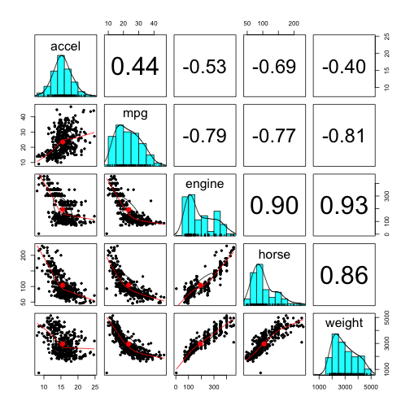
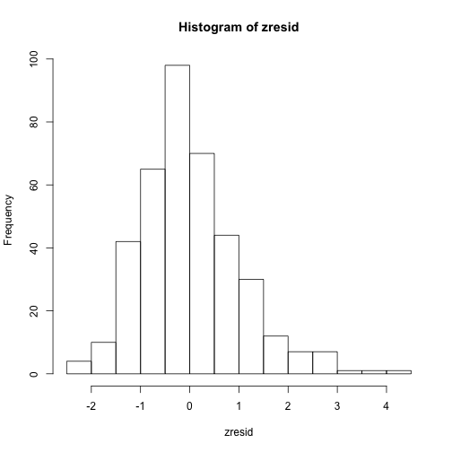
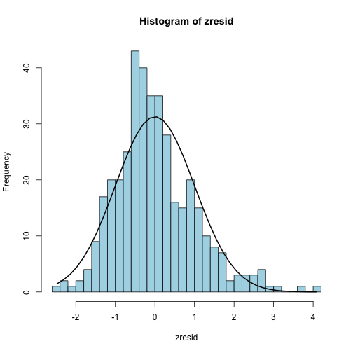
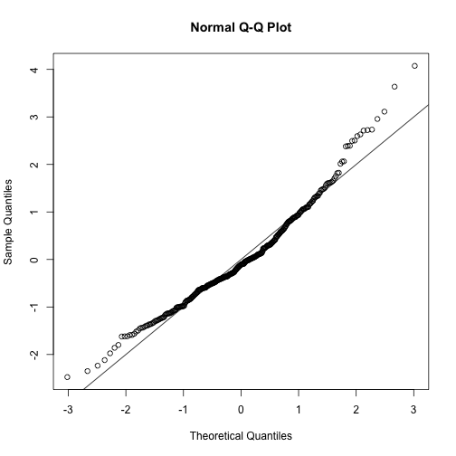
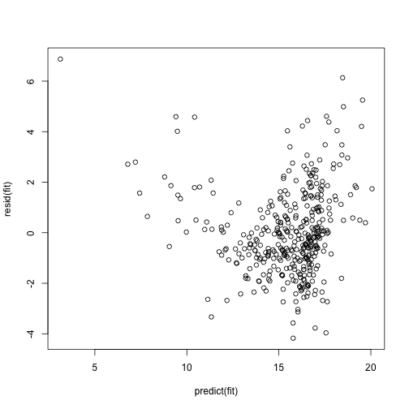
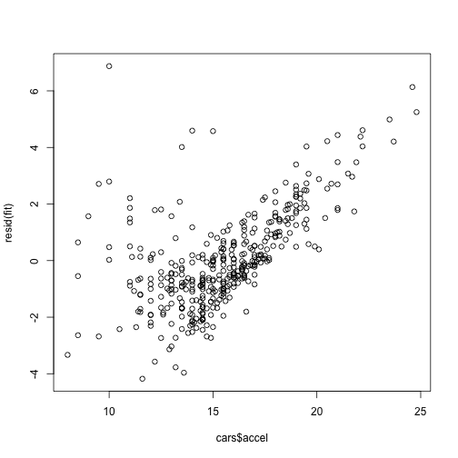

```r
library(foreign)  # read.spss
library(psych)  # describe 
library(Hmisc)  # rcorr 
library(QuantPsyc)  # lm.beta
library(car)  # vif, durbinWatsonTest
library(MASS)  # studres
library(lmSupport)  #lm.sumSquares
library(perturb)  # colldiag
```


In order to emulate SPSS output, it is necessary to install several add-on packages. The above `library` commands load the packages into your R workspace. I've highlighted in the comment the names of the functions that are used in this script. 

You may not have the above packages installed.
If not, run commands like:
* `install.packages('foreign')`
* `install.packages('psych')`
* etc.

for each of the above packages not installed or use the "packages" tab in RStudio to install.

Note also that much of this analysis could be performed using [Rcommander](http://www.rcommander.com/) using a more SPSS-style GUI environment.

# Import and prepare data

```r
cars_raw <- read.spss("cars.sav", to.data.frame = TRUE)
# get rid of missing data listwise
cars <- na.omit(cars_raw[, c("accel", "mpg", "engine", "horse", "weight")])
```


Ensure that `cars.sav` is the working directory.

# Quick look at data

```r
# note the need to deal with missing data
psych::describe(cars_raw)
```

```
##             var   n    mean     sd  median trimmed    mad    min     max
## mpg           1 398   23.51   7.82   23.00   23.06   8.90   9.00   46.60
## engine        2 406  194.04 105.21  148.50  183.75  86.73   4.00  455.00
## horse         3 400  104.83  38.52   95.00  100.36  29.65  46.00  230.00
## weight        4 406 2969.56 849.83 2811.00 2913.97 947.38 732.00 5140.00
## accel         5 406   15.50   2.82   15.50   15.45   2.59   8.00   24.80
## year*         6 405    6.94   3.74    7.00    6.93   4.45   1.00   13.00
## origin*       7 405    1.57   0.80    1.00    1.46   0.00   1.00    3.00
## cylinder*     8 405    3.20   1.33    2.00    3.14   0.00   1.00    5.00
## filter_.*     9 398    1.73   0.44    2.00    1.79   0.00   1.00    2.00
## weightKG     10 406 1346.97 385.48 1275.05 1321.75 429.72 332.03 2331.46
## engineLitre  11 406    3.19   1.73    2.44    3.02   1.42   0.07    7.47
##               range  skew kurtosis    se
## mpg           37.60  0.45    -0.53  0.39
## engine       451.00  0.69    -0.81  5.22
## horse        184.00  1.04     0.55  1.93
## weight      4408.00  0.46    -0.77 42.18
## accel         16.80  0.21     0.35  0.14
## year*         12.00  0.02    -1.21  0.19
## origin*        2.00  0.92    -0.81  0.04
## cylinder*      4.00  0.27    -1.69  0.07
## filter_.*      1.00 -1.04    -0.92  0.02
## weightKG    1999.43  0.46    -0.77 19.13
## engineLitre    7.41  0.69    -0.81  0.09
```

```r

dim(cars)
```

```
## [1] 392   5
```

```r
head(cars)
```

```
##   accel mpg engine horse weight
## 1  12.0  18    307   130   3504
## 2  11.5  15    350   165   3693
## 3  11.0  18    318   150   3436
## 4  12.0  16    304   150   3433
## 5  10.5  17    302   140   3449
## 6  10.0  15    429   198   4341
```

```r
str(cars)
```

```
## 'data.frame':	392 obs. of  5 variables:
##  $ accel : num  12 11.5 11 12 10.5 10 9 8.5 10 8.5 ...
##  $ mpg   : num  18 15 18 16 17 15 14 14 14 15 ...
##  $ engine: num  307 350 318 304 302 429 454 440 455 390 ...
##  $ horse : num  130 165 150 150 140 198 220 215 225 190 ...
##  $ weight: num  3504 3693 3436 3433 3449 ...
##  - attr(*, "na.action")=Class 'omit'  Named int [1:14] 11 12 13 14 15 18 39 40 134 338 ...
##   .. ..- attr(*, "names")= chr [1:14] "11" "12" "13" "14" ...
```


# Fit model

```r
fit <- lm(accel ~ mpg + engine + horse + weight, data = cars)
```


## Descriptive Statistics

```r
# Descriptive statistics
psych::describe(cars)
```

```
##        var   n    mean     sd  median trimmed    mad min    max  range
## accel    1 392   15.52   2.78   15.50   15.46   2.52   8   24.8   16.8
## mpg      2 392   23.45   7.81   22.75   22.99   8.60   9   46.6   37.6
## engine   3 392  193.65 104.94  148.50  183.15  86.73   4  455.0  451.0
## horse    4 392  104.21  38.23   93.00   99.61  28.17  46  230.0  184.0
## weight   5 392 2967.38 852.29 2797.50 2909.64 945.90 732 5140.0 4408.0
##        skew kurtosis    se
## accel  0.27     0.43  0.14
## mpg    0.45    -0.54  0.39
## engine 0.69    -0.77  5.30
## horse  1.09     0.71  1.93
## weight 0.48    -0.76 43.05
```

```r

# correlations
cor(cars)
```

```
##          accel     mpg  engine   horse  weight
## accel   1.0000  0.4375 -0.5298 -0.6936 -0.4013
## mpg     0.4375  1.0000 -0.7893 -0.7713 -0.8072
## engine -0.5298 -0.7893  1.0000  0.8959  0.9339
## horse  -0.6936 -0.7713  0.8959  1.0000  0.8572
## weight -0.4013 -0.8072  0.9339  0.8572  1.0000
```

```r
rcorr(as.matrix(cars))  # include sig test for all correlations
```

```
##        accel   mpg engine horse weight
## accel   1.00  0.44  -0.53 -0.69  -0.40
## mpg     0.44  1.00  -0.79 -0.77  -0.81
## engine -0.53 -0.79   1.00  0.90   0.93
## horse  -0.69 -0.77   0.90  1.00   0.86
## weight -0.40 -0.81   0.93  0.86   1.00
## 
## n= 392 
## 
## 
## P
##        accel mpg engine horse weight
## accel         0   0      0     0    
## mpg     0         0      0     0    
## engine  0     0          0     0    
## horse   0     0   0            0    
## weight  0     0   0      0
```

```r
# scatterplot matrix if you want
pairs.panels(cars)
```

 


## Summary of model

```r
# r-square, adjusted r-square, std. error of estimate, overall ANOVA, df, p,
# unstandardised coefficients, sig tests
summary(fit)
```

```
## 
## Call:
## lm(formula = accel ~ mpg + engine + horse + weight, data = cars)
## 
## Residuals:
##    Min     1Q Median     3Q    Max 
## -4.177 -1.023 -0.184  0.936  6.873 
## 
## Coefficients:
##              Estimate Std. Error t value Pr(>|t|)    
## (Intercept) 16.980778   0.977425   17.37   <2e-16 ***
## mpg          0.007476   0.019298    0.39   0.6987    
## engine      -0.008230   0.002674   -3.08   0.0022 ** 
## horse       -0.087169   0.005204  -16.75   <2e-16 ***
## weight       0.003046   0.000297   10.24   <2e-16 ***
## ---
## Signif. codes:  0 '***' 0.001 '**' 0.01 '*' 0.05 '.' 0.1 ' ' 1
## 
## Residual standard error: 1.7 on 387 degrees of freedom
## Multiple R-squared:  0.631,	Adjusted R-squared:  0.627 
## F-statistic:  166 on 4 and 387 DF,  p-value: <2e-16
```

```r
### additional info in terms of sums of squares
anova(fit)
```

```
## Analysis of Variance Table
## 
## Response: accel
##            Df Sum Sq Mean Sq F value Pr(>F)    
## mpg         1    577     577   200.8 <2e-16 ***
## engine      1    272     272    94.7 <2e-16 ***
## horse       1    753     753   261.8 <2e-16 ***
## weight      1    302     302   104.9 <2e-16 ***
## Residuals 387   1113       3                   
## ---
## Signif. codes:  0 '***' 0.001 '**' 0.01 '*' 0.05 '.' 0.1 ' ' 1
```

```r

# 95% confidence intervals (defaults to 95%)
confint(fit)
```

```
##                 2.5 %    97.5 %
## (Intercept) 15.059049 18.902506
## mpg         -0.030466  0.045418
## engine      -0.013488 -0.002972
## horse       -0.097401 -0.076938
## weight       0.002461  0.003630
```

```r
# but can specify different confidence intervals
confint(fit, level = 0.99)
```

```
##                 0.5 %    99.5 %
## (Intercept) 14.450621 19.510934
## mpg         -0.042478  0.057430
## engine      -0.015153 -0.001308
## horse       -0.100641 -0.073698
## weight       0.002276  0.003816
```

```r

# standardised coefficients
lm.beta(fit)
```

```
##      mpg   engine    horse   weight 
##  0.02101 -0.31093 -1.19988  0.93456
```

```r

# or you could do it manually
zcars <- data.frame(scale(cars))  # make all variables z-scores
zfit <- lm(accel ~ mpg + engine + horse + weight, data = zcars)
coef(zfit)[-1]
```

```
##      mpg   engine    horse   weight 
##  0.02101 -0.31093 -1.19988  0.93456
```

```r

# correlations: zero-order, semi-partial, partial obscure function seems to
# do it
sqrt(lm.sumSquares(fit)[, c(2, 3)])
```

```
##              dR-sqr pEta-sqr
## (Intercept) 0.53638   0.6620
## mpg         0.01000   0.0200
## engine      0.09487   0.1546
## horse       0.51711   0.6483
## weight      0.31623   0.4617
## Error (SSE)      NA       NA
## Total (SST)      NA       NA
```

```r

# or use own function
cor_lm <- function(fit) {
    dv <- names(fit$model)[1]
    dv_data <- fit$model[, dv]
    ivs <- names(fit$model)[-1]
    iv_data <- fit$model[, ivs]
    x <- fit$model
    x_omit <- lapply(ivs, function(X) x[, c(dv, setdiff(ivs, X))])
    names(x_omit) <- ivs
    lapply(x_omit, head)
    fits_omit <- lapply(x_omit, function(X) lm(as.formula(paste(dv, "~ .")), 
        data = X))
    resid_omit <- sapply(fits_omit, resid)
    iv_omit <- lapply(ivs, function(X) lm(as.formula(paste(X, "~ .")), data = iv_data))
    resid_iv_omit <- sapply(iv_omit, resid)
    
    results <- sapply(seq(ivs), function(i) c(zeroorder = cor(iv_data[, i], 
        dv_data), partial = cor(resid_iv_omit[, i], resid_omit[, i]), semipartial = cor(resid_iv_omit[, 
        i], dv_data)))
    results <- data.frame(results)
    
    names(results) <- ivs
    results <- data.frame(t(results))
    results
}

round(cor_lm(fit), 3)
```

```
##        zeroorder partial semipartial
## mpg        0.438   0.020       0.012
## engine    -0.530  -0.155      -0.095
## horse     -0.694  -0.648      -0.517
## weight    -0.401   0.462       0.316
```


## Assumption testing

```r
# Durbin Watson test
durbinWatsonTest(fit)
```

```
##  lag Autocorrelation D-W Statistic p-value
##    1           0.136         1.721   0.004
##  Alternative hypothesis: rho != 0
```

```r

# vif
vif(fit)
```

```
##    mpg engine  horse weight 
##  3.085 10.709  5.383  8.736
```

```r

# tolerance
1/vif(fit)
```

```
##     mpg  engine   horse  weight 
## 0.32415 0.09338 0.18576 0.11447
```

```r

# collinearity diagnostics
colldiag(fit)
```

```
## Condition
## Index	Variance Decomposition Proportions
##           intercept mpg   engine horse weight
## 1   1.000 0.000     0.001 0.001  0.001 0.000 
## 2   3.623 0.002     0.051 0.016  0.005 0.001 
## 3  16.214 0.006     0.066 0.365  0.763 0.019 
## 4  18.519 0.127     0.431 0.243  0.152 0.227 
## 5  32.892 0.865     0.451 0.375  0.079 0.753
```

```r

# residual statistics
rfit <- data.frame(predicted = predict(fit), residuals = resid(fit), studentised_residuals = studres(fit))
psych::describe(rfit)
```

```
##                       var   n  mean   sd median trimmed  mad   min   max
## predicted               1 392 15.52 2.21  16.11   15.80 1.40  3.13 20.06
## residuals               2 392  0.00 1.69  -0.18   -0.11 1.39 -4.18  6.87
## studentised_residuals   3 392  0.00 1.01  -0.11   -0.07 0.82 -2.49  4.47
##                       range  skew kurtosis   se
## predicted             16.93 -1.61     4.10 0.11
## residuals             11.05  0.75     1.10 0.09
## studentised_residuals  6.95  0.81     1.38 0.05
```

```r

# distribution of standarised residuals
zresid <- scale(resid(fit))
hist(zresid)
```

 

```r
# or add normal curve http://www.statmethods.net/graphs/density.html
hist_with_normal_curve <- function(x, breaks = 24) {
    h <- hist(zresid, breaks = breaks, col = "lightblue")
    xfit <- seq(min(x), max(x), length = 40)
    yfit <- dnorm(xfit, mean = mean(x), sd = sd(x))
    yfit <- yfit * diff(h$mids[1:2]) * length(x)
    lines(xfit, yfit, lwd = 2)
}
hist_with_normal_curve(zresid)
```

 

```r

# normality of residuals
qqnorm(zresid)
abline(a = 0, b = 1)
```

 

```r

# plot predicted by residual
plot(predict(fit), resid(fit))
```

 

```r

# plot dependent by residual
plot(cars$accel, resid(fit))
```

 


